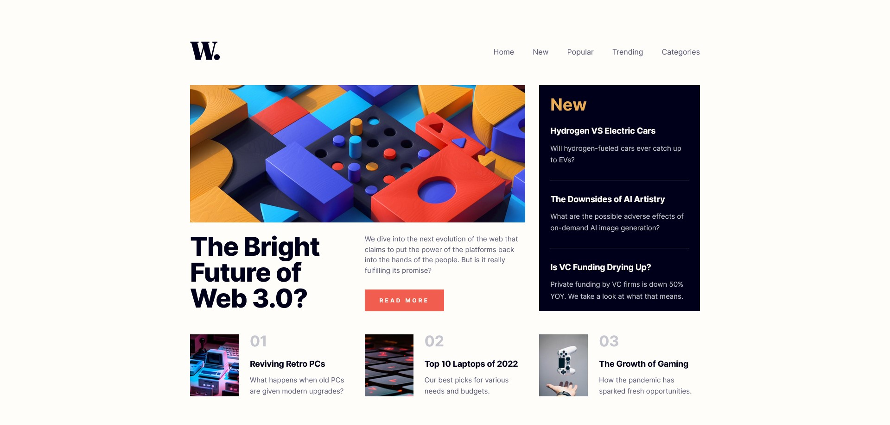

# Frontend Mentor - News homepage solution

This is a solution to the [News homepage challenge on Frontend Mentor](https://www.frontendmentor.io/challenges/news-homepage-H6SWTa1MFl). 

## Table of contents

- [Overview](#overview)
  - [The challenge](#the-challenge)
  - [Screenshot](#screenshot)
  - [Links](#links)
- [My process](#my-process)
  - [Built with](#built-with)
  - [What I learned](#what-i-learned)
- [Author](#author)

## Overview

This is my solution to the news homepage from frontend mentor, I only use HTML, CSS and Javascript, its responsive for all devices. if you see some mistakes or bad practice, please, let me know, I appreciate any feedback, Thanks

### The challenge

Users should be able to:

- View the optimal layout for the interface depending on their device's screen size
- See hover and focus states for all interactive elements on the page

### Screenshot

### Links

- Solution URL: [View code](https://github.com/alexisrulo/news-homepage-main)
- Live Site URL: [Preview site](https://alexisrulo.github.io/news-homepage-main/)

## My process

### Built with

- Semantic HTML5 markup
- CSS custom properties
- Flexbox
- CSS Grid

### What I learned

In this challenge I learned how to implement a navigation bar that hides when used on mobile/tablet and appears when the button is tapped and disappears when the button is tapped again or pressed outside the menu, I learned how to add animations and finally how to use grid.

## Author

- GitHub - [@alexisrulo](https://github.com/alexisrulo)
- Frontend Mentor - [@alexisrulo](https://www.frontendmentor.io/profile/alexisrulo)

